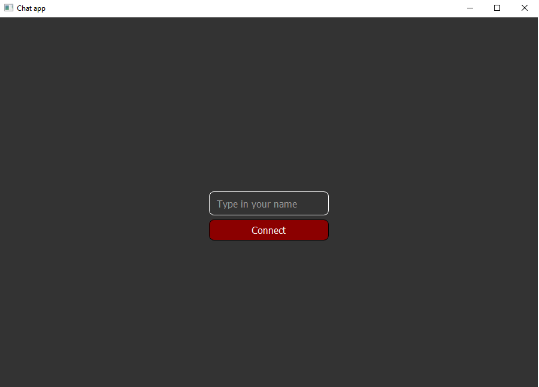
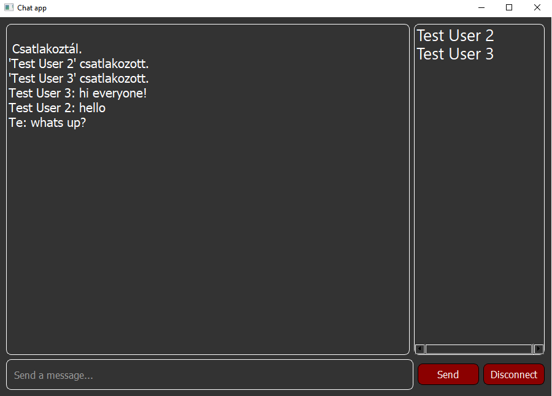
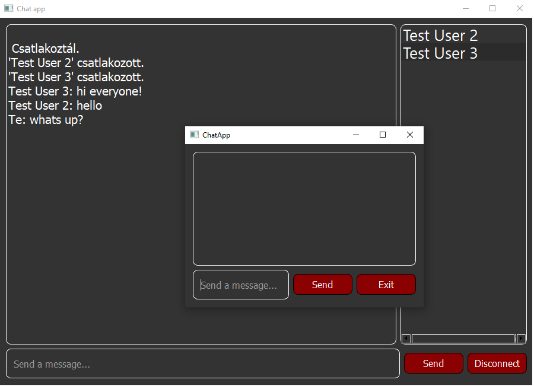

# Desktop mini-chat application written in C++/Qt

## About the project

* The application uses TCP protocoll for communicating with the server.
* The user can chat with multiple users at the same time.
* Each user has a unique nickname.
* The message is wrapped in a packet with other informations, depending on the type of the message.

### Types of messages

* 0 -> when a user has joined
* 1 -> when a user has left
* 2 -> public message
* 3 -> error message
* 4 -> list with all users's name
* 5 -> private message

## Screens

### 1. Starter screen

Here the user can enter the chat.

### 2. Main screen

Here the user can see the conversation with the other users.
On the right side ther is the list with the other online users, after clicking on one user a private message window pops up.

### 3. Private message window

Here the user can private chat with other user.

